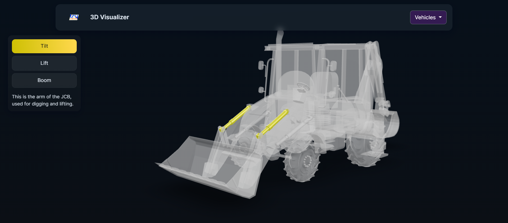

# 3D Visualizer

An interactive 3D visualization tool for viewing and customizing product and industrial models directly in the browser.

This project demonstrates how modern web technologies can be used to build performant, interactive 3D experiences without heavy frameworks, focusing on clean integration, usability, and extensibility.

## Live Demo
https://tryverse.space/projects/3d-visualizer/

## Features
- Load and render 3D models using <model-viewer>
- Orbit, zoom, and pan interactions
- Material color customization
- Mesh highlighting
- Responsive layout for desktop and tablet

## Why this project
I built this to explore:
- How far browser-native 3D (via <model-viewer>) can be pushed without custom engines
- How to structure rendering logic cleanly separate from UI logic
- How to design interactive visualization for product, industrial, and educational use cases

## Tech Stack
- HTML, CSS, JavaScript
- <model-viewer> Web Component
- WebGL (browser native)
- No build step / framework required

## Architecture (brief)
- UI logic and user interaction handling in `app.js`
- Rendering and model configuration via <model-viewer>
- Asset management separated under `/assets`

## Use Cases
- Product visualization
- Industrial model inspection
- Virtual showrooms
- Educational simulations

## Setup
1. Clone the repository
2. Serve locally using any static server or open `index.html`
3. No build process required

## Screenshots
Add a representative screenshot of the visualizer (placed in the `screenshots` folder):

- 

## Author
Sachin Pradhan — Senior Android Engineer / Mobile Technology Lead
